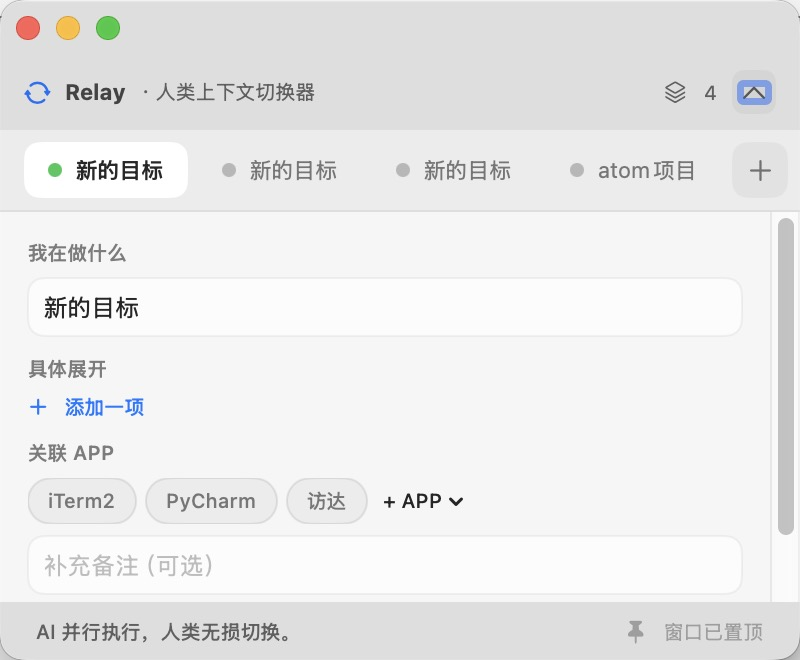

# Relay

**Human Context Switcher / 人类上下文切换器**

> AI 并行执行，人类无损切换。

Relay 是一个轻量、置顶、可收起的 macOS 上下文切换器。它让人类把多个目标放进不同的 Tab，在一个目标卡住时保存现场，立即切到另一个目标继续工作。



## 背景

AI 时代出现了一个有点荒诞的场景：

1. 人类把任务交给 AI；
2. AI 开始工作；
3. 人类盯着 AI 工作；
4. 人类成功把自己变成了阻塞线程。

AI 的执行需要时间，但人类没有必要同步等待。既然 AI 可以并行处理任务，人类也应该像线程一样，在一个上下文进入等待状态后，保存现场并切换到另一个可执行的上下文。

Relay 就是为此而生：帮助人类切换执行上下文，而不是陪着 AI 的加载动画一起思考人生。

## 当前功能

Relay `v0.3.0` 保持克制，只实现上下文切换所需的核心能力：

- 原生 macOS 置顶窗口；
- 一个目标对应一个 Tab，点击即可切换；
- 右键 Tab 可以归档或删除目标，删除前会二次确认；
- 归档箱可以恢复已经收起的目标；
- 新建、编辑和删除目标；
- 每个上下文记录三类信息：
  - **我在做什么**：一句话保存当前现场；
  - **具体展开**：按 `+` 逐条补充下一步、线索或待处理事项；
  - **关联 APP**：多选相关软件，并补充备注；
- 从 Relay 启动后开始统计前台软件切换频率；
- 常用软件优先展示，也可以从全部已安装软件中选择；
- 软件显示为椭圆按钮，点击后变绿，再次点击取消关联；
- 一键收起，只保留顶部和上下文 Tab，避免遮挡工作界面；
- 数据按版本化 JSON 协议保存在本机，关闭或升级应用后不会丢失；
- 同时支持 Apple Silicon 和 Intel Mac。

它不是另一个复杂的 Todo List。Relay 首先解决的是：当一件事暂时做不下去时，人类能否低成本地切走，并在之后准确地回来。

## 安装

### 从 GitHub Release 安装

系统要求：macOS 13 Ventura 或更高版本。

1. 打开项目的 [GitHub Releases](https://github.com/eastonsuo/relay/releases) 页面；
2. 下载 `Relay-v0.3.0.dmg`；
3. 打开 DMG，把 `Relay.app` 拖入 `Applications`；
4. 从“应用程序”中启动 Relay。

Release 同时提供 `Relay-v0.3.0.zip`。解压后把 `Relay.app` 拖入“应用程序”即可。

当前版本使用临时签名，尚未经过 Apple Developer ID 公证。如果 macOS 阻止首次启动：

1. 在 Finder 中按住 Control 点击 `Relay.app`；
2. 选择“打开”；
3. 在确认窗口中再次选择“打开”。

也可以前往“系统设置 → 隐私与安全性”，在安全提示下选择“仍要打开”。

## 使用

1. 点击 Tab 栏末尾的 `+` 创建目标；
2. 填写“我在做什么”；
3. 在“具体展开”中按 `+` 逐条记录下一步和现场信息；
4. 点击椭圆 APP 按钮建立关联，选中项会变绿，也可以补充备注；
5. 点击另一个 Tab，立即切换上下文；
6. 右键上下文 Tab，可以归档或删除；
7. 点击归档箱，可以恢复已经归档的上下文；
8. 点击右上角箭头收起窗口，只保留上下文 Tab；
9. 需要编辑时再次展开。

应用使用信息只保存在本机。Relay 不读取窗口内容、不截图，也不上传应用切换记录。

Relay 的主数据文件位于：

```text
~/Library/Application Support/Relay/relay.json
```

技术设计、升级规则与正式 JSON Schema 见[技术文档](docs/architecture-and-data.md)。重装 Relay.app 不会删除该数据文件。

## 本地构建

构建环境：macOS、Swift 6、Command Line Tools。无需完整 Xcode。

```bash
./scripts/build.sh
```

生成的应用位于：

```text
dist/Relay.app
```

构建 DMG、ZIP 和校验文件：

```bash
./scripts/package.sh
```

产物位于 `dist/`：

- `Relay-v0.3.0.dmg`
- `Relay-v0.3.0.zip`
- `SHA256SUMS.txt`

## 后续计划

### 1. AI 完成提醒

接入 AI 任务状态。当后台 AI 完成、失败或需要人类输入时，通过提醒通知用户，减少人工反复检查。

### 2. 多端同步

在不同设备之间同步目标和上下文信息，让上下文不被限制在一台 Mac 上。

### 3. 界面与窗口感知

感知目标相关的应用和窗口，把它们作为上下文信息的一部分。切换目标时，不只知道“要做什么”，也知道“在哪里做”。

## 核心判断

> AI 是并行的，人类注意力仍然是单线程的。

Relay 不试图让人类同时思考所有事情。它只负责让一个上下文卡住时，人类可以切到下一个。
